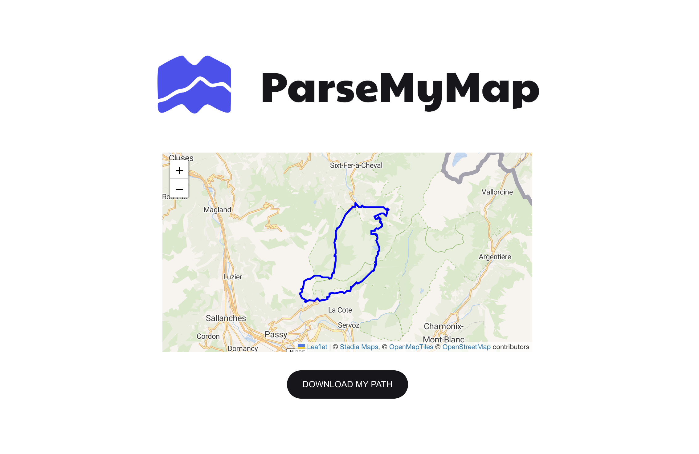

## 🌍 Parser MAP

[](https://lbesson.mit-license.org/)
[](https://npmjs.com/package/parse-my-map)


----

This parser allows for the analysis of GPX, TXT (in CSV format), or XTML files, which are GPS trace file formats.  
The parser returns a JavaScript object containing the file data displayed on a map.

 

### 🛠 Installation
To install the parser, run the following command:

``npm install parse-my-map ``  

or  

``yarn add parse-my-map ``


### 🚀 Usage

To use the parser, import it into your TypeScript code:

```import 'parse-my-map' ```

And add the component:  

```<parse-my-map type="gpx" path="exemple.gpx" width="700" height="500"></parse-my-map> ```

### 🧪 Testing
The parser is accompanied by a set of unit tests. To run these tests, execute the following command:

```npm run test ```  

or  

```yarn run test ```

### 💼 Contributors

Quentin Drouet / Edgar Lecompte / Malaterre Romain  ❤️


### 📜 License
MIT License - see the LICENSE file [LICENSE](LICENSE) for more details.
